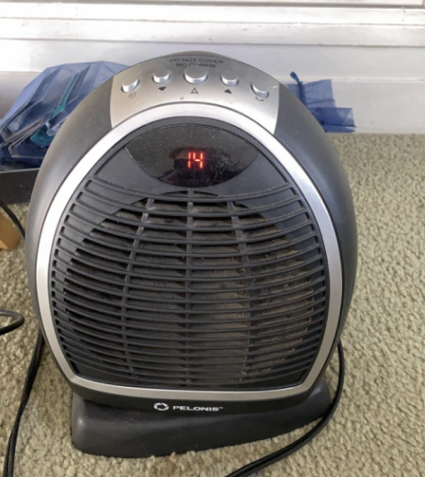

# Turning Up the Heat

I’ve been using this Penlonis space heater for the last couple of months to keep me warm during the winter months. 
It’s been a lifesaver for me as the heaters in my house are terrible, and my room gets little to no heat. When I first got this gadget, 
there was a problem though; I didn’t know how to use it. 

My goal was simple: get heat to warm up the room. I, however, struggled for a while to get it to work as I wanted. My **mental model**(my understanding of how a system works based on my past interactions) told me to press the button in the middle, as more often than not, it means that's the most important button. Pressing the middle button, fortunately, did work and did turn it on. The heater gave **feedback** in two ways: it made a loud beep as well as showing the current temperature. After turning it on, I needed to raise the temperature. This is where the problem came in. It would make the most sense to press the arrows that indicate up and down; however, if you pressed them after turning the heater on, it wouldn’t work. Unbeknownst to me, you have to press the middle button a second time in order to raise or lower the temperature.

Another confusing instance is when you press the middle button a third time. This starts a countdown of 15 seconds, but it took me a while to figure out what this was intended for. It simply turns off the device once the 15 seconds are up, but because I was too impatient to wait and figure out what it did, I always unplugged the device while it was running (which is not recommended). One practical way to fix all of this is to allow the user to turn the temperature up and down directly after turning it on, as well as replacing one of the buttons on the end with an off button. 

**Mental model:** A mental model is the user's idea of how a system functions.

**Feedback:** Feedback is the system’s response that shows the user what happened after an action.
